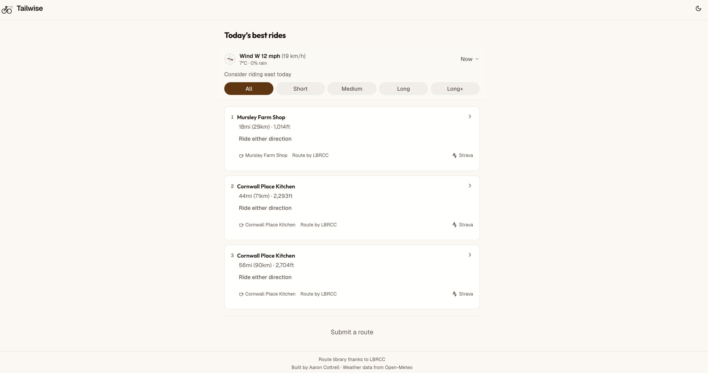
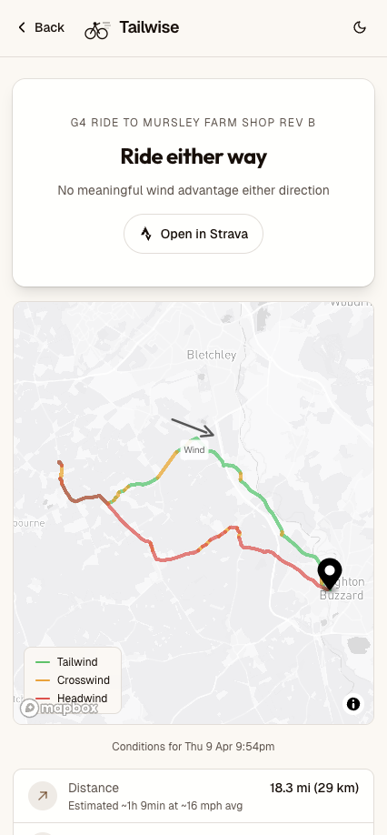

# Tailwise

**Wind-optimised cycling route recommendations so you always have a tailwind on the way home.**

[Live site](https://tailwise-cycle.vercel.app/) - Built for cyclists in and around Leighton Buzzard, UK.



---

## What it does

Tailwise takes a library of cycling routes and ranks them based on real-time wind conditions. For each route, it calculates whether you're better off riding it as-planned or in reverse, and tells you how strong the tailwind advantage is on the homeward leg.

It also integrates with Strava, shows cafes along the way via Google Places, and has a dedicated portal for Leighton Buzzard Road Cycling Club weekly rides.



## Why it exists

Weather is a huge factor in cycling, particularly the wind. Having a nice tailwind on the way home makes a huge difference to the enjoyment of a ride. I've watched and listened to local riders planning routes and it starts with the wind direction and looking at a big list of potential routes, I thought I could make that easier.

Built as a personal project for me and other friends, then extended for my local cycling club.

## Key features

- **Wind-optimised recommendations** - Routes ranked by tailwind advantage on the homeward leg. Confidence levels from "ride either way" to "strong tailwind home."
- **Segment colouring** - Map view colours each route segment by wind condition (green = tailwind, red = headwind).
- **Mobile-first** - Designed for checking on your phone and sharing links with other riders.
- **Route analysis** - Automatically classifies routes as loops, out-and-backs, or point-to-point. Detects clockwise orientation. Calculates outbound and homeward bearings for wind comparison.
- **Cafe stops** - Routes show nearby cafes via Google Places. Because the mid-ride coffee & cake is non-negotiable :).
- **Road closure link** - Links out to one.network to look for road closures. Ideally this would pre-analyse the route but this API is not publicly available, will aim to improve the experience.
- **LBRCC club rides** - Dedicated section for weekly group rides with wind analysis per ride, announcements, and group labels (G1/G2/G3).
- **Strava integration** - Paste any public Strava route URL to check today's wind conditions against it. (Currently hidden from the live site due to Strava's non-verified API limitations.)
- **Community submissions** - Submit routes via Strava URL. Moderated before appearing in the feed.
- **Departure time picker** - Check conditions for different times of day using forecast data.
- **Dark mode** - System preference detection with manual toggle.

## Tech stack

- **Framework**: Next.js 16 with React 19 (App Router, TypeScript)
- **Database**: PostgreSQL on Neon, managed with Drizzle ORM
- **Maps**: Mapbox GL for interactive route visualisation
- **Weather**: Open-Meteo API (free, no key required) with 10-minute server-side cache
- **Auth**: Strava OAuth for route fetching
- **Email**: Resend for admin notifications on new submissions
- **Styling**: Tailwind CSS 4 with OKLCH colour system, Outfit + Geist fonts
- **Hosting**: Vercel

## How the wind logic works

1. Each route has an outbound bearing and a homeward bearing (calculated from the route geometry)
2. The current wind direction and speed come from Open-Meteo
3. For each direction you could ride the route, Tailwise calculates the tailwind component on the homeward leg
4. The direction with more tailwind going home wins
5. Advantage thresholds: < 2 mph = "ride either way", 2-5 mph = "moderate", > 5 mph = "strong"

The goal is simple: minimise headwind when you're tired.

## Local development

```bash
# Install dependencies
npm install

# Set up environment variables (see .env.example)
cp .env.example .env.local

# Run database migrations
npx drizzle-kit push

# Start dev server
npm run dev
```

Requires: Node.js, a PostgreSQL database (Neon free tier works), Strava API credentials, Resend API key and a Mapbox token.

## Architecture

```
src/
  app/           - Next.js pages and API routes
  components/    - UI components (route cards, maps, forms, wind compass)
  lib/
    wind-advisor.ts    - Core recommendation algorithm
    route-analyzer.ts  - Route classification and geometry
    strava.ts          - Strava API client with token caching
    weather-server.ts  - Weather fetching with in-memory cache
    db/                - Drizzle schema, queries, migrations
  constants.ts   - Thresholds, API config, algorithm parameters
```

## Status

Live and being used by LBRCC club members. Actively maintained.

---

Built by [Aaron Cottrell](https://github.com/acottrell)
